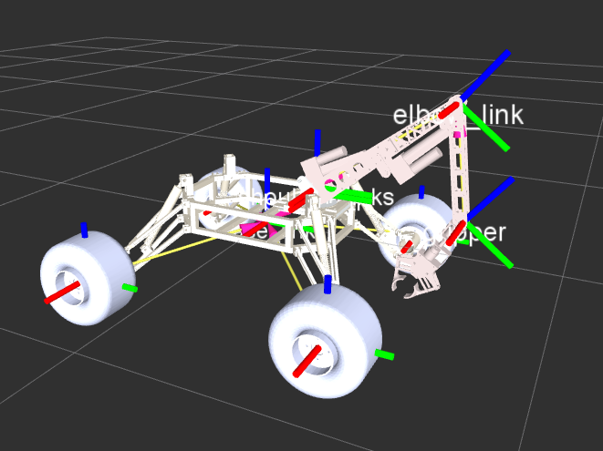

# GUI
GUI for controlling various subsystems of the Mars Rover Project, IIT-Bombay.

<!--  -->

## Visualisation of Rover on RViz

* Execute `roslaunch rover19_urdf display.launch` in root of a ROS workspace, after cloning the repo.

## Design steps involved in making the URDF

The Solidworks URDF plugin as of Feb 2018, is not stable yet. Thus, instead of wasting time with the plugin, the hybrid approach we followed below worked nicely for us, and we didn't have to do much manual work as well.

* First, generate URDF from Solidworks URDF plugin. This will act as a base URDF and we will be modifying it with help of `[3DView](https://chrome.google.com/webstore/detail/3dview/hhngciknjebkeffhafnaodkfidcdlcao?hl=en)` software. Running the URDF at this point will most probably give you a messy rendering with some roll/pitch/yaw offsets. This is due to different alignments in STLs and this is what we will correct in subsequent steps.
* Take STL's from solidworks, with each link in a different STL. Make the complete design altogether in 3DView, which will give you a set of perfect coordinates and rpy angles wrt to the modified STLs. Note down the coordinates of the links. Also, save all the modified STLs (all centered at 0,0,0) and replace the old STLs in `/meshes` with the new ones. You will not have to worry about RPY offsets beyond this point.
	* For joints which rotate/move about some other point than COM, you have to note down both the offset between Joint Point (i.e. where you have to hinge the link) and parent_link coordinate (i.e. `Joint_origin-Parent_origin`), as well as offset between the joint point (i.e. hinged point) and COM.  
* Now, go to the URDF and change the coordinates of the **joints** with what you get from 3DView. In case movement is not about COM, give the offset between COM and hinged point in visual and inertial origin, otherwise, these can be left to "0,0,0". That's it, your URDF should render properly now.  


## ROS-URDF

Follow [this link](http://wiki.ros.org/urdf/XML/joint) for the complete documentation of the XML tags under _joint_, and more.  
_Note that all angle measurements are in **radians**._  

Defining inertia can get crucial for Gazebo modelling. The values are to be given as 3D inertia tensors, and a simple reference can be found [here](https://en.wikipedia.org/wiki/List_of_moments_of_inertia). Accurate data can be obtained from [SolidWorks](https://forum.solidworks.com/thread/59325) or [Inventor](http://forums.autodesk.com/t5/inventor-forum/calculate-moment-of-inertia/td-p/3027000).

* For changing the dimensions in the included mesh file, use the following `<mesh : "Filepath://filename" scale = "multplier_x multiplier_y multiplier_z" >`

## GPS lat long tracking

Work derived from the repository by [Gareth Cross and team](https://github.com/gareth-cross/rviz_satellite/). Changes done to the original code to make the tiles preloaded, as internet access may not be availaible in MDRS, Utah.


---
# Archived Readme from 2016-17


### Gazebo
ROS Indigo has support for Gazebo2 only, (which is not the case with Kinetic). If you have any other version, you need to purge and do :
```
sudo apt-get install gazebo2
sudo apt-get install ros-indigo-gazebo-ros
```

 [_Important!_ ] The [gazebo_ros_control](http://gazebosim.org/tutorials?tut=ros_control) tutorial will explain how to use Rviz to monitor the state of your simulated robot by publishing `/joint_states` directly from Gazebo. **Would be requied!**

``` bash
cd ~/catkin_ws/src
git clone https://github.com/iitbmartian/GUI_MSI_2016
cd ../
catkin_make
source devel/setup.bash

roslaunch msi_2k16_17_gazebo msi.launch
```

To add a custom world in Gazebo, add a parameter while running `world_name:=worlds/willowgarage.world` for the default, or modify the file accordingly as in `msi.launch`.

---
